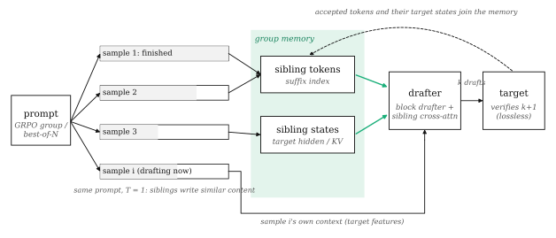
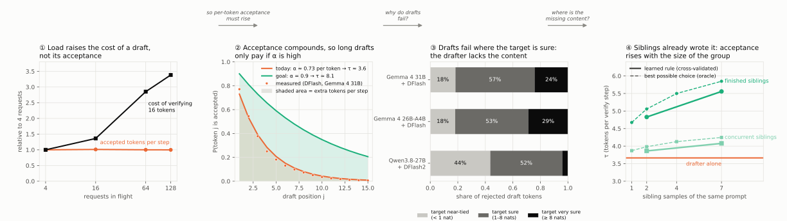
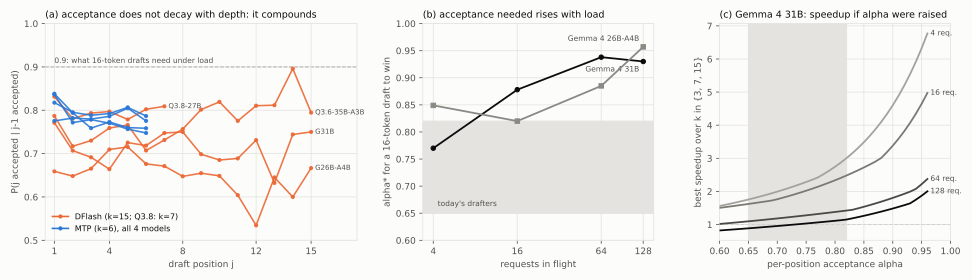
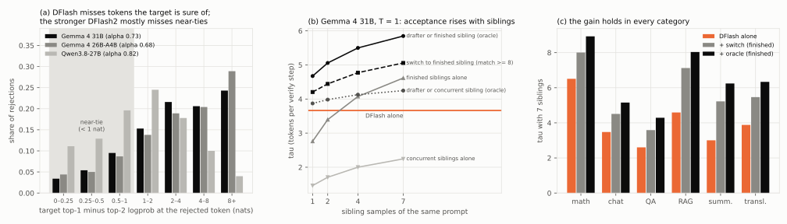
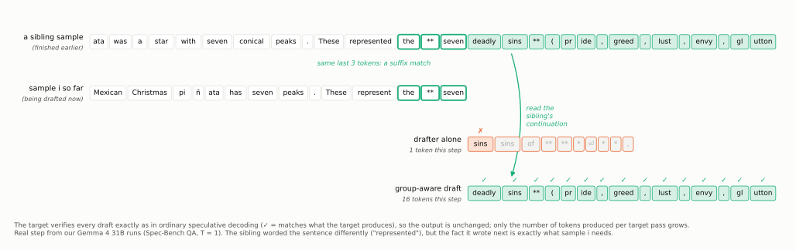
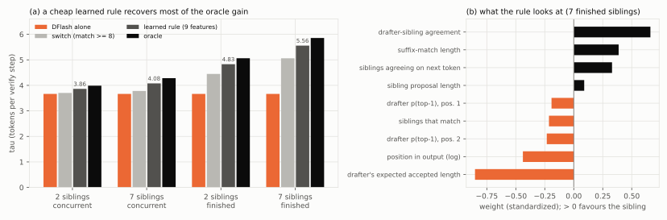

# Group-aware drafting: letting sibling samples raise acceptance

*Proposal, 8 Oct 2026. Data and scripts are in this repo (paths at the end). All numbers are from our MI250 runs unless a paper is cited.*

## The proposal in one paragraph

Many important workloads sample the **same prompt many times at once**. RL training (GRPO) generates 8–64 rollouts per prompt, and best-of-N / self-consistency sample N answers per question. These samples, which we call *siblings*, are independent random draws from the same target model, so they keep writing the same content: the same facts, the same derivation steps, the same phrasing. Today every sibling is drafted on its own, and its drafter has to guess content the target already wrote elsewhere in the batch. We propose a **group-aware drafter**: a block drafter (DFlash/DSpark-style) that also reads a **group memory** of what its siblings have generated (their tokens and the target's hidden states for them). The target still verifies every draft exactly as today, so decoding stays lossless. The payoff is unusual: it is the one way we found for **acceptance to rise with concurrency**, because more correlated requests in flight means more siblings to read. Long drafts then become worth verifying exactly when verification is expensive.

**How we got here, in four measurements** (each panel is real data from this repo; the steps below explain them one by one):

---

## 1. What to read first

**Essential (the mechanics this builds on)**

| Read | Why | What to take away |
|---|---|---|
| Leviathan et al., *Fast Inference from Transformers via Speculative Decoding* (2211.17192) — §2–3 | The draft → verify loop and why it is lossless | Acceptance rule min(1, p/q); expected tokens per step from a per-token acceptance rate |
| DFlash (2602.06036) — §3 | The block drafter we use as the base | One drafter pass proposes a whole block of k tokens, conditioned on target hidden features injected into the drafter's attention |
| DSpark (2607.05147) — §3–4 | Conditioned block drafting plus load-aware verification | Why positions drafted independently lose acceptance; how a calibrated confidence picks how much to verify under load |
| Seer (2511.14617) — the grouped speculative decoding section | The closest prior work, which is model-free | Copying sibling text through a per-group suffix tree; acceptance rises with the number of siblings (τ 1.70 → 2.53 for 0 → 15) |

**Helpful context**

| Read | Why |
|---|---|
| Beyond Parallel Blindness (2608.27339) | Splits rejection into "missing information" vs "modelling error"; reports the same flat per-position acceptance and load-invariant τ we measured |
| SuffixDecoding (2411.04975) | The model-free drafter Seer builds on; its hybrid mode switches between suffix drafts and a neural drafter by a score threshold (our "switch" baseline) |
| Speculative Decoding for Multi-Sample Inference (2503.05330) | The best-of-N version of model-free sibling drafting |
| DeepSeekMath (2402.03300) §4 | What a GRPO rollout group is |
| Carryover Drafting (2609.14717) | A recent example of feeding a drafter extra target-side states, the same kind of plumbing we need |
| EAGLE-3 (2503.01840) | Training a drafter on its own predictions ("training-time test"), needed when the drafter learns to read memory it produced |
| EfficientRollout (2606.18967), NeMo-RL (2604.26779) | Cautionary: model-free rollout drafting can lose wall-clock time at high batch |

---

## 2. The argument, step by step

### Step 1. Speedup is accepted tokens per step divided by the cost of a step, and only the cost depends on load

Each verify step costs one target pass over k+1 tokens per request and returns τ tokens (accepted drafts plus one). So speedup ≈ τ / (step cost relative to a plain decoding step).

On MI250, τ is **identical** from 4 to 128 requests in flight for every model and drafter we ran: for example, DFlash k=15 on Gemma 4 31B gives 3.58, 3.62, 3.58 and 3.58. Other papers report the same (AdaFlash, Beyond Parallel Blindness, LiLiCorr). What changes with load is the cost: verifying 16 tokens instead of 4 costs +0.24 plain steps at 4 requests but +3.3 at 128.

*Intuition:* acceptance is a property of how well the drafter imitates the target, and batching doesn't change that. Batching only makes each extra verified token more expensive.

### Step 2. Acceptance per position is constant along the draft, so long drafts need a high per-position rate

The chance that draft position j is accepted, given that j−1 was, is roughly the same at every position: about 0.65–0.80 for DFlash and 0.76–0.84 for MTP. With a constant rate α, the expected number of tokens per step is 1 + α + α² + … < 1/(1−α). That is about 4 at α = 0.75 and 10 at α = 0.9.

Panel (b) shows the α at which a 16-token draft becomes the best choice on MI250: 0.77 at 4 requests, 0.88 at 16, and 0.93–0.96 at 64–128. Panel (c) shows the payoff: at α = 0.9, Gemma 4 31B at 16 requests would go from about 2.0× to 3.4×.

*Intuition:* each extra draft token is a bet that pays only if every earlier bet also paid. At α = 0.75 the 10th token is reached only 6% of the time, so verifying it is mostly wasted; at α = 0.95 it is reached 63% of the time.

### Step 3. Drafters miss because they lack information, not because the target is undecided

We logged, at every draft position the chain reached, the target's confidence: its top-1 minus top-2 log-probability, called the *margin*. A rejection at a small margin (< 1 nat) is a near-tie the drafter couldn't have known. A rejection at a large margin means the target was sure and the drafter simply didn't know.

| | Gemma 4 31B + DFlash | Gemma 4 26B-A4B + DFlash | Qwen3.8-27B + DFlash2 |
|---|---|---|---|
| per-position acceptance α | 0.73 | 0.68 | 0.82 |
| rejections at near-tied target tokens | 18% | 18% | 44% |
| rejections where the target was very sure (≥ 8 nats) | 24% | 29% | 4% |
| rejected token not in the drafter's top 8 (QA) | 23% (34%) | 27% (38%) | 14% (20%) |

For the DFlash drafters, more than 80% of rejections are tokens the target was confident about. On QA, a third of the rejected tokens are not even among the drafter's 8 best guesses. That is a **missing-information** problem: the answer entity, the next fact, the next step of a derivation. The stronger, conditioned DFlash2 has mostly closed that gap on Qwen3.8; its remaining misses are near-ties (a separate, harder problem, discussed in §4).

*Intuition:* a 1-layer or 5-layer drafter is a small model trying to guess what a 31B model will say. Where the answer depends on knowledge only the big model has, the drafter guesses wrong even though the big model is certain.

### Step 4. In correlated workloads the missing information is already in the batch

When the same prompt is sampled several times at temperature 1, the samples are different random paths through the same distribution, and they share a lot of content. We sampled 48 Spec-Bench prompts 8 times each on Gemma 4 31B (DFlash k=15). At every drafter step we compared two 15-token proposals from the same position: the drafter's chain, and the continuation of the longest exact match of the current text found in a sibling.

One of those steps, token by token: the drafter's own guess fails at the first token, while a sibling that had already answered the same question supplies the next 15 tokens, all of which the target accepts.

Four such steps, where the drafter's chain died immediately and a finished sibling's continuation was accepted in full (15/15). They are four of 313 such steps in just two of the eight seeds:

| Category | Text so far (end) | Drafter proposed | Sibling continuation (= what the target produced) |
|---|---|---|---|
| QA | "…has seven peaks. These represent the **seven" | " sins sins of*****" | " deadly sins** (pride, greed, lust, envy, glutton…" |
| Summarization | "…Police discovered the incident" | " after an anonymous welfare welfare…" | " during a welfare check on March 26, after receiving an anonymous tip" |
| Chat (math) | "**4. Count the integers** To count the number of integers between" | " $a$ and and)b) you formula formula…" | " two bounds $a$ and $b$ (exclusive), you can use" |
| Translation | "German often places long descriptions of the person (app" | "ositive) between the the.. In sentence." | "ositives) in the middle of the sentence. In English, it is" |

The sibling already wrote the fact or structure the drafter was missing ("March 26", "deadly sins", "two bounds … (exclusive)"), even though it phrased the sentence before the match differently.

*Intuition:* think of 8 students answering the same exam question. Predicting student 5's next sentence is much easier if you can read student 1's finished answer, even though no two answers are identical.

### Step 5. More siblings means more accepted tokens: acceptance rises with concurrency

| τ (tokens per verify step), Gemma 4 31B, T = 1 | 1 sibling | 2 | 4 | 7 |
|---|---|---|---|---|
| DFlash alone | 3.66 | | | |
| siblings still generating (only text up to the same point) | 1.46 | 1.71 | 2.00 | 2.25 |
| better of drafter and such a sibling at each step (oracle) | 3.87 | 3.98 | 4.13 | 4.25 |
| finished siblings | 2.76 | 3.40 | 4.08 | 4.62 |
| better of drafter and a finished sibling (oracle) | 4.67 | 5.06 | 5.50 | 5.85 |
| controls: the sample's own earlier text / other prompts' outputs | 1.06 / 1.04 | | | |

- **The gain grows with group size and appears in every category** (7 finished siblings, oracle): +37% math, +48% chat, +65% QA, +75% RAG, +108% summarization, +63% translation.
- **It is sibling-specific.** Copying from the sample's own history or from other prompts gives almost nothing (τ ≈ 1.05).
- **Progress matters.** A sibling that is still at the same point has not written the future yet (+16% at 7). A finished sibling has (+60%). Real systems are in between: siblings run at different speeds, and in RL the slow "long-tail" rollouts that dominate step time run while their siblings have already finished.

This is exactly the property your second research line needs. Acceptance can only depend on concurrency if concurrent requests share information, and siblings are the case where they do.

### Step 6. Copying is not enough: the drafter has to learn when and how to use siblings

The oracle above picks the better proposal *after* seeing the answer. A real system must decide beforehand. A naive rule ("use the sibling if its match is ≥ 8 tokens", SuffixDecoding-hybrid style) captures little. A small learned rule does much better. We used a logistic regression on 9 features available at draft time, trained and scored with 4-fold cross-validation split by prompt.

| τ, 7 siblings | drafter | switch rule | learned rule | oracle | share of gap closed |
|---|---|---|---|---|---|
| concurrent siblings | 3.66 | 3.78 | **4.08 (+11%)** | 4.28 | 68% (switch: 19%) |
| finished siblings | 3.66 | 5.06 | **5.56 (+52%)** | 5.86 | 86% (switch: 64%) |

The rule needs no extra verification: it still sends one chain per step. Its weights are readable (panel b). It **trusts the drafter when the drafter is confident** (expected accepted length has the largest negative weight), and **trusts the siblings when they agree with each other and match a long suffix**.

*Intuition:* siblings are a strong but noisy oracle. They agree on facts and structure and disagree on wording. Knowing which situation you are in is worth a lot, and even 9 features find most of it. A drafter that reads the sibling text directly can go further: it can mix the sibling's fact with its own phrasing, which a chooser between two whole chains cannot.

### Step 7. The proposal: a group-aware block drafter

1. **Group memory.** For each prompt group, keep the siblings' generated tokens in a suffix index, and keep the target's last-layer hidden states for those tokens, which verification already computes. Both are updated after every verify step. Memory is per group, so it is small (G × output length).
2. **Retrieval.** At each draft step for sample i, find the siblings whose text matches the end of sample i's text and take their continuations: the next k tokens, plus the target states for them. This is the Seer-style lookup, used as *input* rather than as the draft.
3. **Conditioned drafting.** The block drafter (DFlash/DSpark backbone) proposes k tokens as today, from sample i's own target features. In addition, each draft position cross-attends to the retrieved sibling continuations, in token embeddings and target states, and a learned gate decides how much to rely on them. The learned rule in Step 6 is the crude, external version of that gate.
4. **Verification unchanged.** The target verifies the k drafts with the standard rule, so the output distribution is exactly the target's. At T = 1 the drafter's proposal distribution must be the one used in the acceptance test, as for any drafter.
5. **Draft length from agreement.** When siblings agree and the drafter is confident, survival is high, so draft and verify longer (e.g. 16–32 tokens). Otherwise stay short. This plugs into DSpark-style load-aware verification: higher predicted survival buys deeper verification under load.
6. **Training.** Generate groups of samples per prompt from the target, as in RL rollouts or best-of-N. Train the drafter on each sample with its siblings' text and states as memory, and with the drafter's own outputs as inputs (EAGLE-3-style training-time test). Siblings must be strictly other samples, never the sample's own future, so there is no leakage.

### Step 8. How this answers your two lines

- **Long drafts:** sibling content lifts acceptance where the drafter lacks information, which per Step 3 is most of DFlash's misses. Higher per-position α is what makes long drafts worth verifying (Step 2).
- **High concurrency:** in correlated workloads, concurrency *is* the group, so more requests in flight means more siblings and higher acceptance (Step 5). Today acceptance is flat with load while cost rises; with group-aware drafting, acceptance rises as load rises.

### Step 9. What exists, and what would be new

- **Exists, model-free:** Seer (OSDI'26), SRT, Speculative Decoding for Multi-Sample Inference, STAND, and implicitly vLLM's suffix method and SGLang's NGRAM. All copy sibling text through suffix trees or n-gram tables, at τ ≈ 2–3.
- **Exists, adjacent:** RL drafters trained on rollouts (FastGRPO, ReSpec, TLT, NeMo-RL) use siblings only as training data. Hybrid systems (Graft, APEX, SuffixDecoding hybrid) add retrieved candidates to the draft tree after drafting.
- **New:** a neural drafter that takes concurrent siblings' tokens and target states as **input**, with acceptance and useful draft length growing with group size on top of a strong neural baseline. Graft lists "MTP + n-gram over group history" as future work, so others are close. The comparison that matters is against **DFlash/DSpark + group suffix candidates** (Seer-style) at G = 8–16, T = 1.

### Step 10. Plan

| Phase | What | Cost | Decides |
|---|---|---|---|
| P0 (done) | Offline M1/M2 measurements + learned selector | — | Headroom exists: oracle +16% / +60%, learned rule +11% / +52% |
| P1 | RL-style workload: Qwen3.x / Gemma 4 math with thinking, G = 8–16, T = 1, long outputs; log sibling progress during real concurrent decoding | ~1 GPU-day | How close real progress is to "finished"; whether gains survive on reasoning traces |
| P2 | Baselines in vLLM: DFlash, DFlash + group suffix candidates (Seer-style), learned selector | ~2–3 days of engineering | The bar to beat, with wall-clock at concurrency 16–128 |
| P3 | Train the group-aware drafter: DFlash/DSpark backbone + sibling cross-attention + gate; data from target-generated groups | ~1–2 weeks | Does conditioning beat selection (> oracle-of-two)? |
| P4 | Serving eval: τ, per-position α, speedup vs concurrency, draft length policy; exactness check | ~1 week | The paper result |

Metrics: τ and per-position α by group size and sibling progress; speedup vs concurrency; verified tokens per accepted token; memory overhead per group.

### Step 11. Risks and open questions

- **No siblings, no gain.** At T = 0 siblings are identical, and ordinary chat traffic is independent. This targets RL rollouts, best-of-N and agent fan-out, which are large workloads but not all of serving.
- **Sibling progress.** If siblings move in lockstep, only the concurrent numbers (+16% oracle, +11% learned) apply. RL's long tail favours the finished case, but P1 must measure it.
- **Temperature and diversity.** Siblings agree less at higher temperature or with more diverse policies; RL policies typically become *less* diverse during training (ReCo, RhymeRL), which helps.
- **Overhead.** Suffix lookups and cross-attention add drafter cost; model-free rollout drafting has lost wall-clock time at high batch (EfficientRollout, NeMo-RL), so P2 must report wall-clock, not just τ.
- **Competition.** The model-free version is published, and the neural version is named as future work by others. Speed matters.
- **Our evidence is offline:** realized-match estimates on 48 Spec-Bench prompts with Gemma 4 31B at 512 tokens. The oracle is an upper bound on choosing between two proposals; the learned rule is cross-validated but small-scale.

---

## Figures in this proposal

| File | Shows |
|---|---|
| `l1_tree.svg/pdf` | The literature tree with the path to this proposal in blue (block-drafter line via DFlash, sibling-copying line via Seer) |
| `m0_story.svg/pdf` | The motivation in four measured steps (load vs acceptance, compounding, why drafts fail, siblings) |
| `m1_mechanism.svg/pdf` | One real draft step, token by token: drafter alone vs reading a sibling |
| `s4_proposal.svg/pdf` | System schematic |
| `l5_depth.svg/pdf` | Flat per-position acceptance; acceptance needed for long drafts by load; speedup vs α |
| `l6_measurements.svg/pdf` | M1 rejection anatomy; M2 τ vs number of siblings; per-category gain |
| `l7_selector.svg/pdf` | Learned selector vs switch vs oracle; what the rule looks at |
| `gap_analysis_2026.md`, `papers_2026.md`, `l1_tree.pdf`–`l4_gaps.pdf` | Literature map and gap analysis behind the choice |

## Reproduce

- M1: `scripts/draftlog/` (logging hook), `scripts/rejection_anatomy.py results/m1/<model>/<tag>`
- M2: `scripts/sibling_predictability.py results/m2/gemma-4-31B-it dflash15`
- Selector: `scripts/sibling_selector.py results/m2/gemma-4-31B-it dflash15`
- Examples: `scripts/sibling_example.py` (writes `lit/sibling_examples.json`); figures: `scripts/make_story_figs.py`, `scripts/make_depth_plot.py`, `scripts/make_m_plots.py`, `scripts/make_proposal_figs.py`
- Runs: `results/m/jobs/queue.tsv` (vLLM 0.30, MI250, eager mode for logging)
